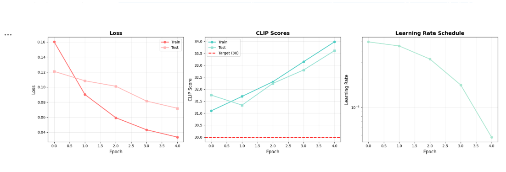

# CLIP Fine-Tuning для поиска одежды

Проект по дообучению модели CLIP на датасете товаров одежды для создания системы поиска изображений по текстовым описаниям.

## Описание

Реализована система поиска товаров одежды по текстовым запросам с использованием дообученной модели CLIP. Модель научилась понимать связь между изображениями одежды и их текстовыми описаниями, достигнув точности ~93%.

### Ключевые возможности:
- Поиск товаров по текстовому описанию
- CLIP Score > 30 (достигнут 33.6)
- Точность ~93% (Loss 0.0719)
- Аугментация данных для улучшения обобщения
- Векторная база эмбеддингов для быстрого поиска

## Структура проекта
```
CLIP_FT/
├── config/
│   └── paths.py              # Конфигурация путей
├── data/
│   ├── raw/                  # Сырые данные
│   ├── extracted/            # Распакованные данные
│   └── processed/            # Обработанные данные
│       ├── split/            # Train/test разделение
│       └── image_embeddings.npz  # Векторные представления
├── src/
│   ├── get_raw_data.py       # Скачивание датасета
│   ├── Preprocess.py         # Предобработка данных
│   ├── Model_training.py     # Обучение модели
│   └── search.py             # Поиск товаров
├── checkpoints/
│   ├── best_model.pt         # Лучшая модель
│   └── training_history.png  # Графики обучения
└── notebooks/
    └── solution.ipynb        # Анализ и эксперименты
```

## Установка

### Требования
- Python 3.8+
- CUDA (опционально, для GPU)

### Установка зависимостей
```bash
# Создание виртуального окружения
python -m venv .venv
source .venv/bin/activate  # Windows: .venv\Scripts\activate

# Установка пакетов
pip install -r requirements.txt
```

##  Использование

### 1. Скачивание датасета
```bash
python src/get_raw_data.py
```

### 2. Предобработка данных
```bash
python src/preprocess.py
```

Выполняет:
- Удаление дубликатов
- Очистку пустых описаний
- Разделение на train/test (90/10)
- Склеивание колонок с доступными текстовым описаниями в `full_text`

### 3. Обучение модели
```bash
python src/Model_training.py
```

**Параметры обучения:**
- Модель: `openai/clip-vit-base-patch32`
- Эпохи: до 5 (с early stopping)
- Learning rate: 5e-6 с Cosine Annealing
- Batch size: 32
- Аугментация: RandomCrop, Flip, ColorJitter, Rotation

### 4. Поиск товаров
```bash
python src/search.py
```

Интерактивная система поиска:
```
Запрос: blue jeans
→ Топ-5 релевантных товаров с CLIP Scores
```

## 📈 Результаты

| Метрика | Значение |
|---------|----------|
| **Train CLIP Score** | 33.98 |
| **Test CLIP Score** | 33.61 |
| **Train Loss** | 0.0335 |
| **Test Loss** | 0.0719 |
| **Точность** | ~93% |

### Графики обучения



**Выводы:**
- Цель (CLIP Score > 30) достигнута
- Нет переобучения
- Аугментация эффективна
- Модель готова к использованию

##  API функций

### Поиск товаров
```python
from src.search import search_products, load_embeddings

# Загрузка данных
data = load_embeddings('data/processed/image_embeddings.npz')

# Поиск
results = search_products(
    query="red summer dress",
    model=model,
    processor=processor,
    image_embeddings=data['embeddings'],
    image_names=data['image_names'],
    dataframe=data['dataframe'],
    top_k=5
)
```

### Загрузка модели
```python
from transformers import CLIPModel, CLIPProcessor
import torch

model = CLIPModel.from_pretrained("openai/clip-vit-base-patch32")
processor = CLIPProcessor.from_pretrained("openai/clip-vit-base-patch32")

checkpoint = torch.load('checkpoints/best_model.pt')
model.load_state_dict(checkpoint['model_state_dict'])
model.eval()
```

##  Датасет

**Fashion Product Images Dataset**
- Источник: Kaggle
- Размер: ~44k изображений
- Категории: одежда, обувь, аксессуары
- Формат: JPG изображения + CSV с метаданными

**Структура CSV:**
- `image`: название файла
- `description`: описание товара
- `display name`: название товара
- `category`: категория

## Улучшения

Реализованные оптимизации:
- Аугментация изображений (crop, flip, color jitter, rotation)
- Learning Rate Scheduling (Cosine Annealing)
- Конкатенация названия и описания (`full_text`)

Возможные улучшения:
- Hard Negative Mining для примеров, где путает платья и ночнушки или короткие юбки и шорты
- Заморозка ранних слоев
- Увеличение датасета
- Более мощная модель

## Технологии

- **PyTorch** - фреймворк для обучения
- **Transformers** - модель CLIP от HuggingFace
- **NumPy** - работа с векторами
- **Pandas** - обработка данных
- **Pillow** - работа с изображениями
- **Matplotlib** - визуализация
